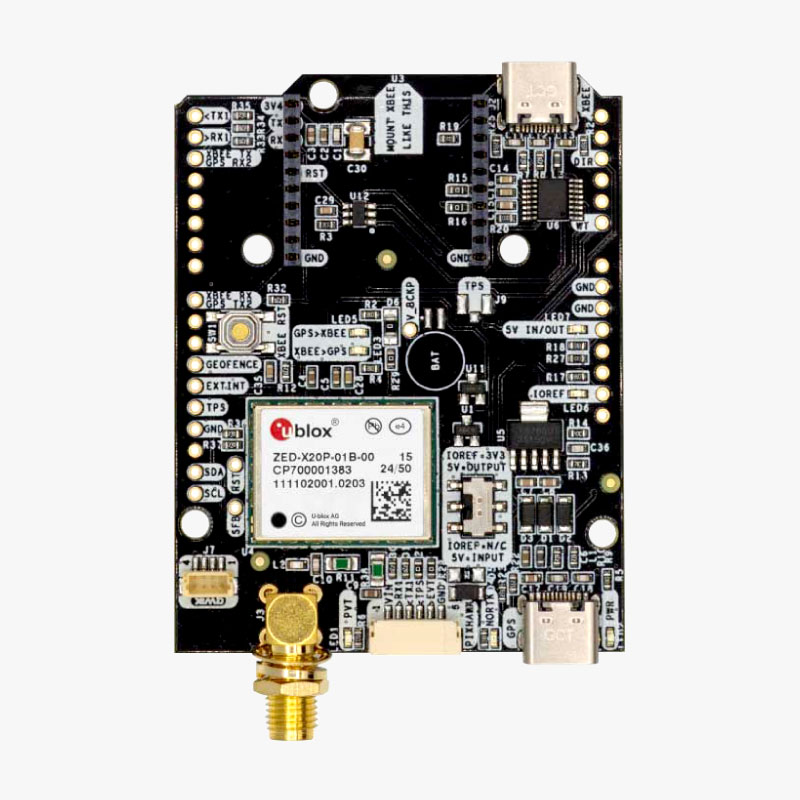
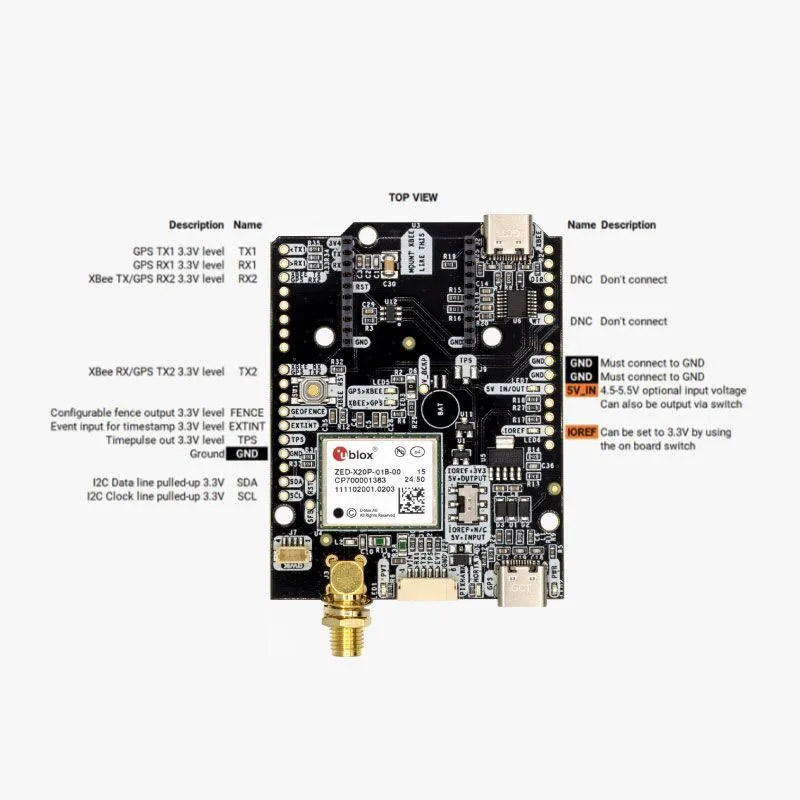

.. _common-ardusimple-rtk-gps-simplertk-4-optimum:

========================================================
ArduSimple RTK GPS simpleRTK 4 Optimum (u-blox ZED-X20P)
========================================================

simpleRTK 4 Optimum (u-blox ZED-X20P) is an allband GNSS/RTK receiver which provides centimeter accurate GNSS positioning and navigation for more accurate and reliable autonomous operations. 
It supports all major satellite constellations and the L1, L2, L5, and L6 frequency bands, making it a great choice if you need reliable, high-accuracy positioning in challenging environments.  

It provides:

   -  Down to centimeter GPS accuracy
   -  Up to 20 RTK position updates per second 
   -  Allband: L1, L2, L5, and L6 support (Galileo HAS too)

Where to Buy
============

- `ArduSimple simpleRTK 4 Pro (u-blox ZED-X20D) <https://www.ardusimple.com/product/simplertk4-optimum-zed-x20p/>`_

Pin Map
=======

The system is connected to the autopilot via one of its UARTs.

The JST-GH connector is following the Pixhawk standard:

   -  1: 5V_IN
   -  2: ZED-X20P UART1 RX (3.3V level)
   -  3: ZED-X20P UART1 TX (3.3V level)
   -  4: Timepulse output (3.3V level)
   -  5: Event input (3.3V level)
   -  6: GND

Wiring and Connections
======================
All ArduSimple GNSS models come with a JST GH 6-pin connector/cable that is compatible with the Pixhawk family and many other autopilots.

XBee socket
===========
The onboard XBee socket can be used to expand functionality with `Plugin accessories <https://www.ardusimple.com/radio-links/>`_ (MR/LR radios, 2G/3G/4G modem, Bluetooth, WiFi, Ethernet, Dataloggers, RS232, Canbus, L-Band). 
The cables/connectors may be modified to connect to other autopilot boards, using the Pin Map information provided above.

ArduPilot integration
=====================
For normal GPS only operation, ArduPilot’s GPS parameter defaults will work for any serial port configured for ``SERIALx_PROTOCOL`` = 5.

To achieve centimeter-level precision in positioning, RTK correction data must be sent to your drone in real time. There are two main methods for delivering this correction data:

   -  Using NTRIP correction service:  If you are going to operate in areas with reliable internet connection and NTRIP service coverage, follow `Tutorial on sending NTRIP corrections to ArduPilot. <https://www.ardusimple.com/send-ntrip-corrections-to-ardupilot-with-missionplanner-qgroundcontrol-and-mavproxy/>`_  If you are not aware of NTRIP service provider in your area, we have prepared the `List of RTK correction service providers in your country. <https://www.ardusimple.com/rtk-correction-services-in-your-country/>`_ 
   -  Using RTK corrections from a Base Station: if there is no internet access or NTRIP correction service available in your area, refer to ArduSimple’s `tutorial on sending RTK corrections from Base station to ArduPilot. <https://www.ardusimple.com/send-rtk-base-station-corrections-to-ardupilot-with-missionplanner-qgroundcontrol-and-mavproxy/>`_ 

More information
================
   -  `User Guide: simpleRTK 4 Optimum <https://www.ardusimple.com/user-guide-simplertk4-optimum/>`_  
   -  `How to configure u-blox ZED-X20 <https://www.ardusimple.com/how-to-configure-u-blox-zed-x20p/>`_ 
