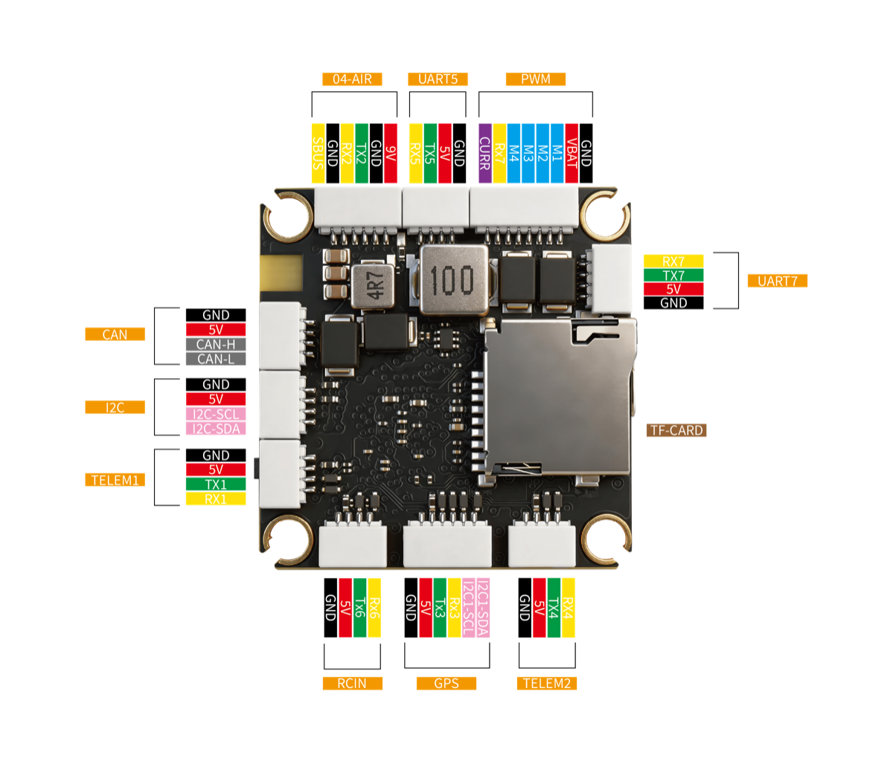
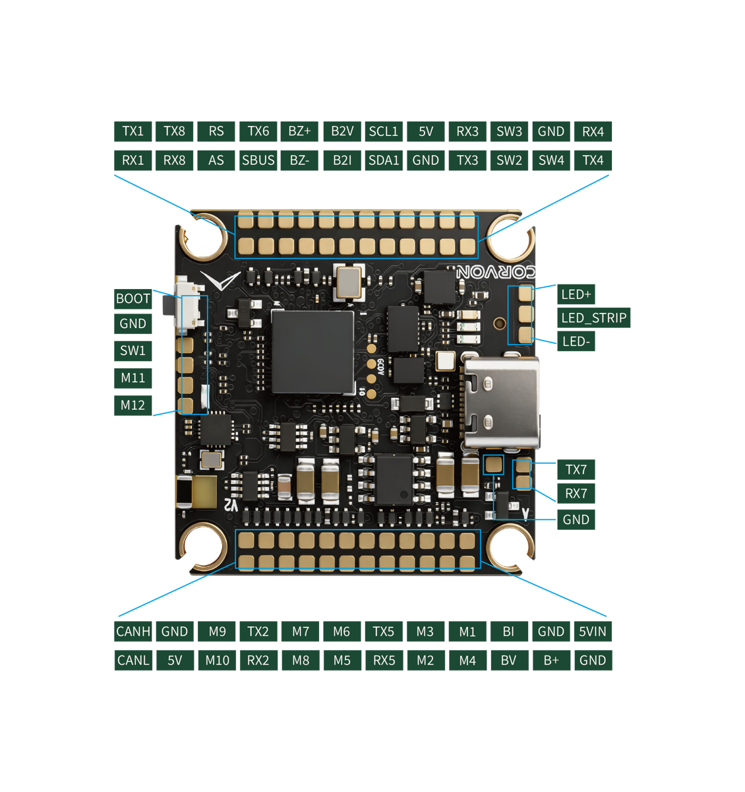

.. _common-corvon743v2:

[copywiki destination="plane,copter,rover,blimp,sub"]
===========
CORVON743V2
===========

The CORVON743V2 is a flight controller designed and produced by CORVON, built
around the STM32H743 with 10 motor outputs and 2 servo outputs.

.. image:: ../../../images/CORVON743V2_FrontView.jpg
   :target: ../_images/CORVON743V2_FrontView.jpg

.. image:: ../../../images/CORVON743V2_BackView.jpg
   :target: ../_images/CORVON743V2_BackView.jpg

Features
========

* STM32H743VIH6 microcontroller (Cortex-M7 @ 480 MHz, 2 MB flash, 1 MB RAM)
* ICM-42688P and BMI088 IMUs
* BMP581 barometer
* IST8310 magnetometer
* 10 DShot motor outputs (bidirectional DShot on outputs 1-8) plus 2 PWM servo outputs
* 8 UARTs plus USB
* 1 CAN (DroneCAN)
* Dual analog battery monitoring
* Analog airspeed and RSSI inputs
* microSD card slot for logging
* Onboard Bluetooth module for telemetry
* RGB status LED and WS2812 serial LED output
* Passive piezo buzzer
* 4 user GPIO pads (SW1-SW4)

Mechanical
==========

* Mounting: 30.5 x 30.5mm, Φ4mm
* Dimensions: 36 x 36 x 8 mm
* Weight: 9.1g

Pinouts
=======

UART Mapping
============

* SERIAL0 -> USB (MAVLink2)
* SERIAL1 -> USART1 (MAVLink2, TELEM1 connector)
* SERIAL2 -> USART2 (MSP DisplayPort, O4-AIR connector)
* SERIAL3 -> USART3 (GPS, GPS connector)
* SERIAL4 -> UART4 (MAVLink2, TELEM2 connector)
* SERIAL5 -> UART5 (no default protocol, UART5 pads)
* SERIAL6 -> USART6 (RC input, RCIN and O4-AIR connectors)
* SERIAL7 -> UART7 (ESC telemetry, UART7 pads)
* SERIAL8 -> UART8 (MAVLink2 at 115200 baud, onboard Bluetooth)

The O4-AIR connector is a 6-pin header that plugs straight into a DJI O4/O3
Air Unit: USART2 carries the MSP DisplayPort link, its SBUS pin is wired to
the RC input on USART6, and the remaining pins supply power and ground.

Bluetooth
=========

The board has an onboard Bluetooth Classic (SPP) module connected to UART8
(SERIAL8), set up for MAVLink2 at 115200 baud by default, so a ground station
can connect wirelessly without any configuration.

RC Input
========

RC input is on the RCIN connector (USART6) with :ref:`SERIAL6_PROTOCOL<SERIAL6_PROTOCOL>`
set to "23" by default. It supports SBUS, CRSF, ELRS, and other serial RC
protocols; bidirectional protocols such as CRSF and ELRS use both the TX and
RX pins. The SBUS pin of the O4-AIR connector feeds the same input. See
:ref:`common-rc-systems` for details on each protocol.

OSD Support
===========

The default configuration sets :ref:`OSD_TYPE<OSD_TYPE>` = 5 (MSP DisplayPort)
on SERIAL2, so a DJI O4/O3 Air Unit connected to the O4-AIR connector shows
the OSD overlay without any additional setup. The board has no onboard analog
OSD chip, so analog video OSD is not supported.

PWM Output
==========

The CORVON743V2 provides 12 motor/servo outputs plus a serial LED output. All
motor outputs support PWM, DShot, and bidirectional DShot on outputs 1-8.

The outputs are grouped and every output in a group must use the same output
rate and protocol:

* 1, 2, 3, 4 are Group 1 (bidirectional DShot capable)
* 5, 6 are Group 2 (bidirectional DShot capable)
* 7, 8, 9, 10 are Group 3 (bidirectional DShot capable on 7 and 8)
* 11, 12 are Group 4 (PWM only, intended for servos)
* 13 is Group 5 (WS2812 serial LED output, see below)

LEDs
====

The board has a GPIO-driven RGB status LED used by the ArduPilot notify
system.

A WS2812 serial LED (NeoPixel) output is broken out on the
LED+ / LED_STRIP / LED- pads: LED+ is 5V, LED_STRIP is the data signal
(output 13), and LED- is ground. It is enabled by default, so a strip lights
up out of the box; set :ref:`NTF_LED_LEN<NTF_LED_LEN>` to the number of LEDs
on the strip.

GPIOs
=====

The motor/servo outputs and the four SW pads can be used as GPIOs (for
relays, PINIO, etc.). SW1-SW4 are general purpose user pads, not a dedicated
safety switch.

* M1-M13 are GPIOs 50-62
* SW1-SW4 are GPIOs 70-73

Battery Monitoring
==================

The board has two independent analog battery inputs for voltage and current,
on the BV/BI pads (battery 1) and B2V/B2I pads (battery 2).

The default battery parameters are:

* :ref:`BATT_MONITOR<BATT_MONITOR>` = 4
* :ref:`BATT_VOLT_PIN<BATT_VOLT_PIN__AP_BattMonitor_Analog>` = 10
* :ref:`BATT_CURR_PIN<BATT_CURR_PIN__AP_BattMonitor_Analog>` = 11
* :ref:`BATT_VOLT_MULT<BATT_VOLT_MULT__AP_BattMonitor_Analog>` = 21.12
* :ref:`BATT_AMP_PERVLT<BATT_AMP_PERVLT__AP_BattMonitor_Analog>` = 40.2
* :ref:`BATT2_MONITOR<BATT2_MONITOR>` = 4
* :ref:`BATT2_VOLT_PIN<BATT2_VOLT_PIN__AP_BattMonitor_Analog>` = 4
* :ref:`BATT2_CURR_PIN<BATT2_CURR_PIN__AP_BattMonitor_Analog>` = 8
* :ref:`BATT2_VOLT_MULT<BATT2_VOLT_MULT__AP_BattMonitor_Analog>` = 21.12
* :ref:`BATT2_AMP_PERVLT<BATT2_AMP_PERVLT__AP_BattMonitor_Analog>` = 40.2

Both battery monitors are enabled by default; tune the voltage and current
scales to match the power modules in use.

Analog Inputs
=============

In addition to the two battery monitors, the board provides:

* Analog airspeed input on the AS pad (analog pin 18); set :ref:`ARSPD_TYPE<ARSPD_TYPE>` = 2 to enable
* Analog RSSI input on the RS pad (analog pin 3); set :ref:`RSSI_TYPE<RSSI_TYPE>` = 1 to enable

Compass
=======

The CORVON743V2 has a built-in IST8310 compass. Due to potential interference
from the power system, users normally disable it and use an external compass
attached to the GPS connector (I2C1), which is auto-detected via ArduPilot's
normal compass probing.

CAN
===

A single FDCAN interface is exposed on the CAN connector for DroneCAN
peripherals.

Loading Firmware
================

Firmware for this board can be found `here <https://firmware.ardupilot.org>`__
in sub-folders labeled "CORVON743V2".

The board ships with an ArduPilot bootloader, so "\*.apj" firmware can be
loaded from any ArduPilot ground station. To update the bootloader itself,
flash the "with_bl.hex" firmware over DFU (plug in USB with the bootloader
button pressed) using your favorite DFU loading tool.
